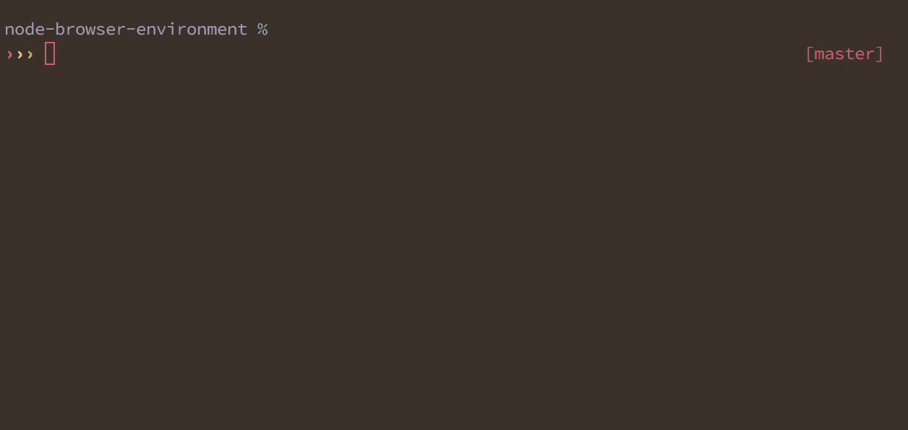

# zsh-better-npm-completion

> Better completion for `npm`



* Makes `npm install` recommendations from npm cache
* Makes `npm uninstall` recommendations from `dependencies`/`devDependencies`
* Shows detailed information on script contents for `npm run`
* Falls back to default npm completions if we don't have anything better

## Installation

### Using [Antigen](https://github.com/zsh-users/antigen)

Bundle `zsh-better-npm-completion` in your `.zshrc`

```shell
antigen bundle lukechilds/zsh-better-npm-completion
```

### Using [zplug](https://github.com/b4b4r07/zplug)
Load `zsh-better-npm-completion` as a plugin in your `.zshrc`

```shell
zplug "lukechilds/zsh-better-npm-completion", defer:2

```
### Using [zgen](https://github.com/tarjoilija/zgen)

Include the load command in your `.zshrc`

```shell
zgen load lukechilds/zsh-better-npm-completion
```

### As an [Oh My ZSH!](https://github.com/robbyrussell/oh-my-zsh) custom plugin

Clone `zsh-better-npm-completion` into your custom plugins repo

```shell
git clone https://github.com/lukechilds/zsh-better-npm-completion ~/.oh-my-zsh/custom/plugins/zsh-better-npm-completion
```
Then load as a plugin in your `.zshrc`

```shell
plugins+=(zsh-better-npm-completion)
```

### Manually
Clone this repository somewhere (`~/.zsh-better-npm-completion` for example)

```shell
git clone https://github.com/lukechilds/zsh-better-npm-completion.git ~/.zsh-better-npm-completion
```
Then source it in your `.zshrc`

```shell
source ~/.zsh-better-npm-completion/zsh-better-npm-completion.plugin.zsh
```

## Related

- [`zsh-nvm`](https://github.com/lukechilds/zsh-nvm) - Zsh plugin for installing, updating and loading `nvm`
- [`gifgen`](https://github.com/lukechilds/gifgen) - Simple high quality GIF encoding 

## License

MIT © Luke Childs
